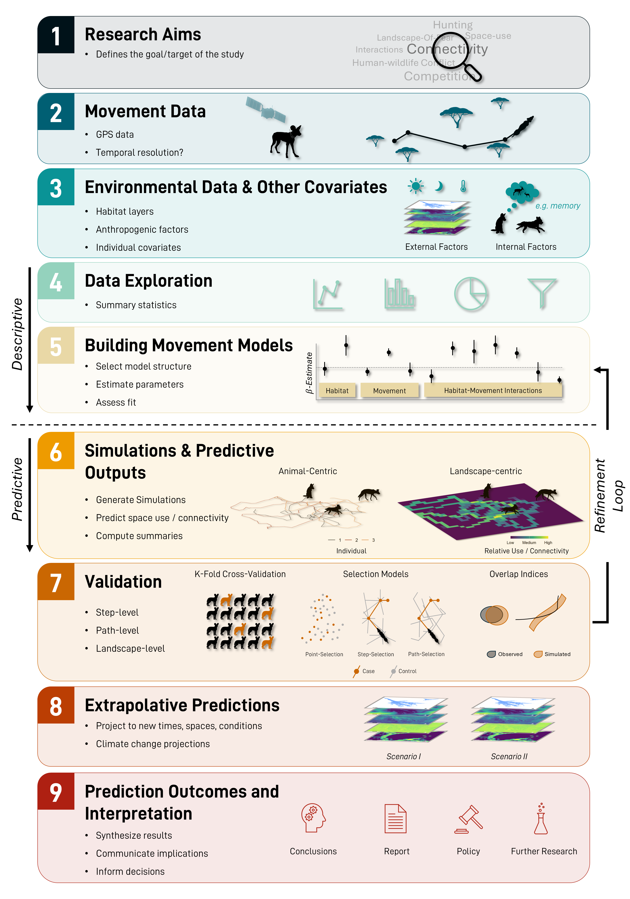

This website accompanies the paper 'Predictive movement ecology using spatial simulations'. 

The tabs at the top have scripts and tutorials that you may find helpful.

These include:

-   **Exploration of temporal dynamics**: Visualise how movement and habitat selection changes through time, before any model fitting.

-   **SSF Formulations**: Assess how different formulations of the step selection function (SSF) can be used to provide more flexibility within the habitat selection process. Also fit different temporally dynamic models to explore how movement and habitat selection changes through time.

-   **Assessing environmental extrapolation**: Use the Shape metric to assess the degree of extrapolation (via environmental distance) is present in the covariates that are being predicted over. This can be used to identify areas where predictions are likely to be unreliable.

