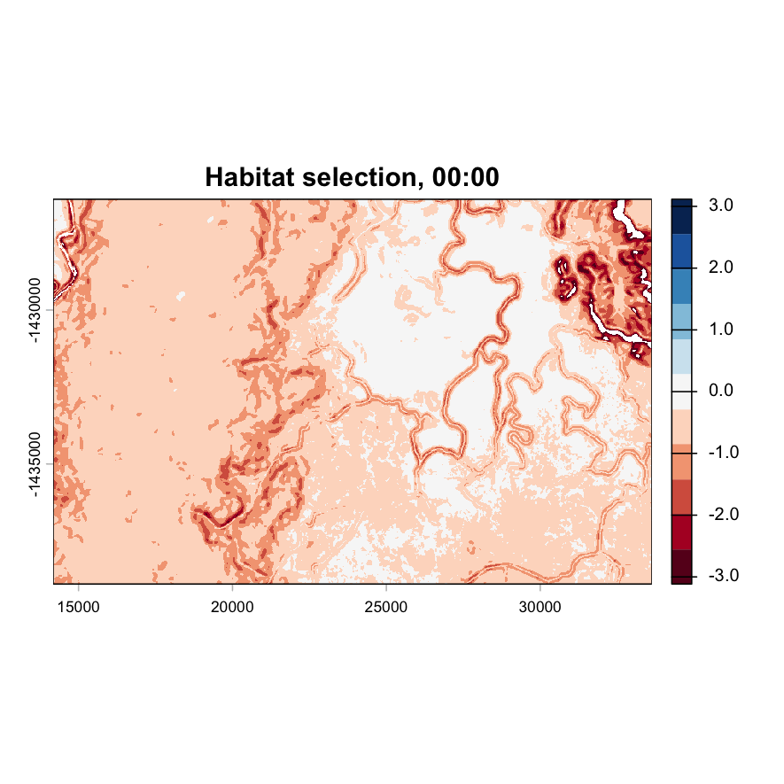
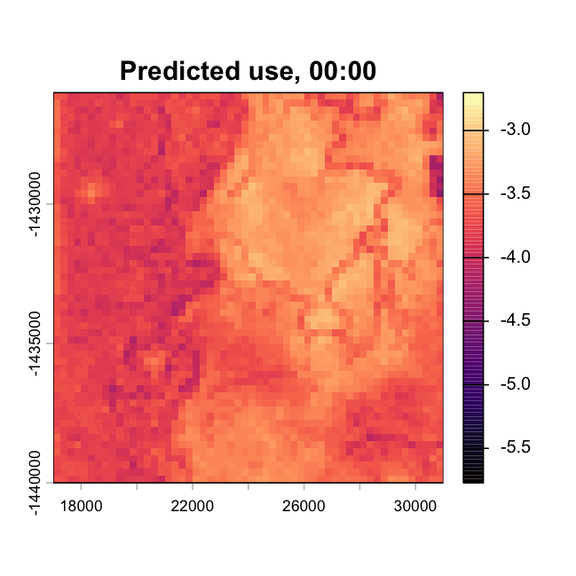

# Introduction

A step selection function (SSF) is usually the *end* of an analysis: we fit the model, report the
coefficients, and interpret which habitats an animal selected for. But a fitted SSF is also a
complete, generative description of a movement process. If we can fit it, we can *simulate* from
it — and simulated trajectories can be turned into spatial predictions that we can validate.

This walkthrough takes that full path:

```
fit  ->  simulate  ->  aggregate  ->  hourly summaries  ->  assess predictions
```

It is a simplified version of the analysis in @Forrest2025-le, whose full code lives at
[github.com/swforrest/dynamic_SSF_sims](https://github.com/swforrest/dynamic_SSF_sims). Where that
repository spreads the work across six scripts and a high-performance computing cluster, here we
compress it into one script that runs on a laptop.

Throughout, we fit **two** models and carry both all the way to the end:

| | |
|---|---|
| **Model A — static** | An ordinary integrated SSF (iSSF). One selection coefficient per covariate, constant across the day. |
| **Model B — temporally dynamic** | A GAM in which each coefficient is a smooth, cyclic function of the hour of day. |

Carrying both through is the point. It is easy to show that a more flexible model produces more
interesting-looking coefficients. It is much more informative to ask whether those coefficients
translate into *better predictions* — and that requires simulating, aggregating and validating.

# Setup

## Load required packages

```{r}
#| label: packages

library(tidyverse)
packages <- c("amt", "sf", "terra", "mgcv", "gratia", "lubridate",
              "RColorBrewer", "viridis", "patchwork", "tictoc", "magick")
walk(packages, require, character.only = TRUE)

# Two packages are deliberately NOT attached, and are called with `::` instead:
#
#  - `circular`, for the von Mises distribution. Attaching it would mask
#    `stats::sd` and `stats::var`, which is an easy trap to fall into later.
#  - `ecospat`, used once for the Boyce index; it pulls in a large dependency tree.

options(scipen = 999)
```

## Parameters

Every quantity that controls the size or behaviour of the analysis lives here, so the whole
walkthrough can be re-run at a different scale without hunting through the script. The defaults
are chosen to run in a reasonable time on a laptop; the comments indicate what to increase for
publication-quality results.

```{r}
#| label: parameters

# A seed here makes the model-fitting steps (which random steps are drawn, which
# cells are sampled for plots) reproducible. It is deliberately NOT relied on for
# the simulations: each simulation set seeds itself explicitly, because a single
# seed at the top of a script does not survive edits made anywhere above the code
# you care about. See section 8.
set.seed(2158)

# --- Data selection ------------------------------------------------------
which_buffalo <- 2158                                          # individual to analyse
season_start  <- as.POSIXct("2018-07-25", tz = "Australia/Darwin")
season_end    <- as.POSIXct("2018-11-01", tz = "Australia/Darwin")

# --- Model fitting -------------------------------------------------------
n_control <- 25    # number of available (random) steps per used step

# --- Simulation ----------------------------------------------------------
n_traj  <- 1000    # number of simulated trajectories (paper used 100,000)
n_steps <- 1440    # steps per trajectory; hourly in this case
n_ch    <- 25      # candidate steps evaluated at each step of the simulation
burn_in <- 24      # leading steps discarded from each trajectory (1 day)

# --- Aggregation ---------------------------------------------------------
ud_res        <- 100   # resolution (m) of the all-hours utilisation distribution
ud_res_hourly <- 250   # resolution (m) of each hourly UD - coarser, as each
                       # hourly layer contains only ~1/24 of the locations

# --- Output --------------------------------------------------------------
# Scratch plots and intermediate files. `outputs/` is gitignored.
plot_save_path <- "outputs/walkthrough"
dir.create(plot_save_path, showWarnings = FALSE, recursive = TRUE)

# Figures embedded in the rendered page must live somewhere tracked by git, or
# they will be missing from the published site. `figures/` already is.
figure_save_path <- "figures/walkthrough"
dir.create(figure_save_path, showWarnings = FALSE, recursive = TRUE)
```

# 1. Data

## Import the GPS data

We use GPS tracking data from water buffalo (*Bubalus bubalis*) in Arnhem Land, northern
Australia. The cleaned dataset contains 14 individuals tracked at approximately hourly intervals
between July 2018 and October 2019.

```{r}
#| label: import_data

buffalo_data <- read_csv("data/buffalo_clean.csv", show_col_types = FALSE)

# The times are stored as UTC; set the correct local time zone. This matters a
# great deal here - the entire analysis is about time of *day*, so an incorrect
# time zone would shift every daily pattern we estimate.
attr(buffalo_data$time, "tzone") <- "Australia/Darwin"

head(buffalo_data)
tz(buffalo_data$time)

buffalo_ids <- unique(buffalo_data$id)
buffalo_ids
```

## Create a track object

The `amt` package [@Signer2019-fi] provides the infrastructure for step selection analysis. We
first convert the data into a *track*, and project it from geographic coordinates (longitude and
latitude) into a projected coordinate system with metres as units — essential, because step
lengths need to be in metres, not degrees.

```{r}
#| label: make_track

buffalo_all <- buffalo_data %>%
  mk_track(id = id, lon, lat, time, all_cols = TRUE, crs = 4326) %>%
  # Transform to GDA94 / Geoscience Australia Lambert (https://epsg.io/3112)
  transform_coords(crs_to = 3112, crs_from = 4326)

buffalo_all
```

```{r}
#| label: plot_all_buffalo
#| fig-cap: "All 14 buffalo in the dataset."

buffalo_all %>%
  ggplot(aes(x = x_, y = y_, colour = factor(id))) +
  geom_point(alpha = 0.5, size = 0.1) +
  coord_fixed() +
  scale_x_continuous("Easting (m)") +
  scale_y_continuous("Northing (m)") +
  scale_colour_viridis_d("ID") +
  theme_classic()
```

## Select a single individual and a single season

We restrict the analysis to **one individual over one season**, for two reasons.

*One individual* keeps the walkthrough focused on the simulation pipeline rather than on the
modelling questions that arise with multiple animals (pooling, random effects, two-step
estimation). It also makes validation unambiguous: we compare predicted space use against *this
animal's* observed locations.

*One season* matters more than it might appear. Buffalo `r which_buffalo` is not range-stationary
across the full 15 months of data — it shifts roughly 20 km east during 2019. A long-term
utilisation distribution validated against the whole track would score badly for reasons that have
nothing to do with the quality of the model. Restricting to the 2018 dry season keeps the animal
within one contiguous area, and also matches our NDVI layer, which represents August 2018.

```{r}
#| label: select_individual

buffalo_id <- buffalo_all %>%
  filter(id == which_buffalo,
         t_ >= season_start,
         t_ <  season_end)

cat("Number of locations:", nrow(buffalo_id), "\n")
cat("Date range:", format(min(buffalo_id$t_)), "to", format(max(buffalo_id$t_)), "\n")
```

```{r}
#| label: plot_individual
#| fig-cap: "The trajectory of the focal individual over the 2018 dry season."

buffalo_id %>%
  ggplot(aes(x = x_, y = y_, colour = t_)) +
  geom_path(alpha = 0.4, linewidth = 0.3) +
  geom_point(alpha = 0.5, size = 0.3) +
  coord_fixed() +
  scale_x_continuous("Easting (m)") +
  scale_y_continuous("Northing (m)") +
  scale_colour_viridis_c("Date", trans = "time") +
  theme_classic()
```

## Check the sampling rate

Step selection analysis assumes a *regular* sampling interval. Before going further we check that
assumption, because irregular fixes would make step lengths incomparable and would corrupt the
mapping between step number and hour of day that the whole temporal analysis depends on.

```{r}
#| label: sampling_rate

summarize_sampling_rate(buffalo_id)
```

```{r}
#| label: plot_sampling_rate
#| fig-cap: "Distribution of time intervals between consecutive fixes."

sampling_intervals <- as.numeric(diff(buffalo_id$t_), units = "hours")

ggplot(data.frame(dt = sampling_intervals[sampling_intervals < 6]), aes(x = dt)) +
  geom_histogram(bins = 60, fill = "steelblue", colour = "white") +
  geom_vline(xintercept = 1, linetype = "dashed", colour = "red") +
  labs(x = "Interval between fixes (hours)", y = "Count") +
  theme_classic()
```

The overwhelming majority of fixes are one hour apart, so we treat this as an hourly trajectory.

# 2. Environmental covariates

We use three covariates, all at 25 m resolution and on the same grid:

- **NDVI** — the Normalised Difference Vegetation Index, a measure of vegetation greenness and
  productivity. Here it also distinguishes water bodies (strongly negative values).
- **Canopy cover** — percentage tree canopy cover, rescaled to 0–1. Relevant for shade and
  thermoregulation.
- **Slope** — terrain slope in degrees.

```{r}
#| label: import_rasters

ndvi <- rast("mapping/ndvi_aug_2018.tif")
names(ndvi) <- "ndvi"

# Rescale canopy cover from a percentage (0-100) to a proportion (0-1), so that
# its coefficient is on a scale comparable to the other covariates.
canopy <- rast("mapping/canopy_cover.tif") / 100
names(canopy) <- "canopy"

slope <- rast("mapping/slope_raster.tif")
names(slope) <- "slope"

# All three layers share an extent and resolution, so they can be stacked directly
covariates <- c(ndvi, canopy, slope)
covariates
```

## Define the simulation extent

Simulating over the full raster would be wasteful — most of it is far from anywhere this animal
ever went, and we would need vastly more trajectories to fill it. Instead we crop to a box around
the observed locations, with a generous buffer so that the simulated animal has somewhere to go.

```{r}
#| label: sim_extent

# A buffered box around the observed dry-season locations
sim_extent <- ext(17000, 31000, -1440000, -1426000)

covariates_crop <- crop(covariates, sim_extent)
covariates_crop

# Individual layers, used throughout the rest of the script
ndvi_crop   <- covariates_crop[["ndvi"]]
canopy_crop <- covariates_crop[["canopy"]]
slope_crop  <- covariates_crop[["slope"]]
```

```{r}
#| label: plot_covariates
#| fig-height: 4
#| fig-cap: "The three covariates across the simulation extent, with observed locations in red."

par(mfrow = c(1, 3), mar = c(2, 2, 3, 4))
for (lyr in c("ndvi", "canopy", "slope")) {
  plot(covariates_crop[[lyr]], main = lyr)
  points(buffalo_id$x_, buffalo_id$y_, col = rgb(1, 0, 0, 0.15), pch = 16, cex = 0.2)
}
par(mfrow = c(1, 1))
```

## Used versus available: a first look

Before fitting anything, it is worth looking at what the animal *used* against what was
*available*. This is the intuition that a habitat selection model formalises: if an animal is
selecting, the distribution of covariate values at its locations will differ from the distribution
across the landscape.

```{r}
#| label: used_vs_available
#| fig-height: 3.2
#| fig-cap: "Distribution of covariate values across the landscape (grey) and at observed locations (blue)."

# Covariate values at the observed locations
used_vals <- terra::extract(covariates_crop,
                            cbind(buffalo_id$x_, buffalo_id$y_)) %>%
  pivot_longer(everything(), names_to = "covariate", values_to = "value") %>%
  mutate(source = "Used")

# Covariate values across the whole landscape (a sample, for plotting speed)
avail_vals <- terra::spatSample(covariates_crop, size = 20000, na.rm = TRUE) %>%
  pivot_longer(everything(), names_to = "covariate", values_to = "value") %>%
  mutate(source = "Available")

bind_rows(avail_vals, used_vals) %>%
  filter(!is.na(value)) %>%
  ggplot(aes(x = value, fill = source)) +
  geom_density(alpha = 0.5, colour = NA) +
  facet_wrap(~ covariate, scales = "free") +
  scale_fill_manual(values = c("Available" = "grey50", "Used" = "steelblue"), name = NULL) +
  labs(x = "Covariate value", y = "Density") +
  theme_classic() +
  theme(legend.position = "bottom")
```

# 3. Generating steps and random steps

## From locations to steps

A step selection function models *steps* — the movement from one location to the next — rather
than locations. Each step has a length and a turning angle relative to the previous step.

```{r}
#| label: make_steps

buffalo_steps <- buffalo_id %>% steps()

head(buffalo_steps)
```

## Tentative movement distributions

Integrated step selection analysis (iSSA) works by first fitting *tentative* distributions to the
observed step lengths and turning angles, using those to generate available steps, and then
**correcting** them using the coefficients that the model estimates for the movement terms
[@Avgar2016-pb; @Fieberg2021-wx].

The word *tentative* is important. These are not the final estimates of the movement kernel — they
are a proposal distribution. We recover the corrected parameters in section 6.

```{r}
#| label: tentative_distributions

gamma_dist    <- fit_distr(buffalo_steps$sl_, "gamma")
vonmises_dist <- fit_distr(buffalo_steps$ta_, "vonmises")

# Store the tentative parameters - we need them later for the update step
shape_tentative <- gamma_dist$params$shape
scale_tentative <- gamma_dist$params$scale
kappa_tentative <- vonmises_dist$params$kappa

cat("Tentative gamma  - shape:", round(shape_tentative, 4),
    " scale:", round(scale_tentative, 2), "\n")
cat("Tentative vonMises - kappa:", round(kappa_tentative, 4), "\n")
```

```{r}
#| label: plot_tentative
#| fig-height: 3
#| fig-cap: "Observed step lengths and turning angles with the fitted tentative distributions."

p_sl <- ggplot(buffalo_steps %>% filter(sl_ > 0), aes(x = sl_)) +
  geom_histogram(aes(y = after_stat(density)), bins = 80,
                 fill = "grey70", colour = "white") +
  stat_function(fun = dgamma,
                args = list(shape = shape_tentative, scale = scale_tentative),
                colour = "red", linewidth = 0.8) +
  scale_x_continuous("Step length (m)", limits = c(0, 2000)) +
  labs(y = "Density") +
  theme_classic()

p_ta <- ggplot(buffalo_steps %>% filter(!is.na(ta_)), aes(x = ta_)) +
  geom_histogram(aes(y = after_stat(density)), bins = 60,
                 fill = "grey70", colour = "white") +
  stat_function(fun = function(x) {
    circular::dvonmises(circular::circular(x),
                        mu = circular::circular(0), kappa = kappa_tentative)
  }, colour = "red", linewidth = 0.8) +
  scale_x_continuous("Turning angle (rad)",
                     breaks = c(-pi, -pi/2, 0, pi/2, pi),
                     labels = c("-π", "-π/2", "0", "π/2", "π")) +
  labs(y = "Density") +
  theme_classic()

p_sl + p_ta
```

## Sample available steps

For each observed (*used*) step we generate `r n_control` *available* steps from the tentative
distributions, and extract the covariate values at the end of every step.

Note the naming of the movement terms: `sl_`, `log_sl_` and `cos_ta_`, each with a **trailing
underscore**. This is `amt`'s convention, and following it means that `amt::update_sl_distr()` and
`amt::update_ta_distr()` will work on our fitted model without any manual specification — which we
make use of as a cross-check in section 6.

```{r}
#| label: random_steps

ssf_data <- buffalo_steps %>%
  random_steps(n_control = n_control,
               sl_distr  = gamma_dist,
               ta_distr  = vonmises_dist) %>%
  extract_covariates(covariates) %>%
  mutate(
    log_sl_ = log(sl_),
    cos_ta_ = cos(ta_),
    hour    = hour(t1_),   # hour of day at the START of the step
    times   = 1            # a dummy column of constant values, required by the
                           # Cox proportional hazards family in `mgcv` (see below)
  ) %>%
  # Drop steps falling outside the covariate layers, and any zero-length steps
  # (log(0) is undefined)
  filter(!is.na(ndvi), !is.na(canopy), !is.na(slope), sl_ > 0)

cat("Rows:", nrow(ssf_data),
    " | strata (used steps):", length(unique(ssf_data$step_id_)), "\n")

head(ssf_data)
```

```{r}
#| label: plot_used_available_steps
#| fig-height: 3.2
#| fig-cap: "Covariate values at the end of used steps versus available steps."

ssf_data %>%
  select(case_, ndvi, canopy, slope) %>%
  pivot_longer(c(ndvi, canopy, slope), names_to = "covariate", values_to = "value") %>%
  mutate(case_ = ifelse(case_, "Used", "Available")) %>%
  ggplot(aes(x = value, fill = case_)) +
  geom_density(alpha = 0.5, colour = NA) +
  facet_wrap(~ covariate, scales = "free") +
  scale_fill_manual(values = c("Available" = "grey50", "Used" = "steelblue"), name = NULL) +
  labs(x = "Covariate value", y = "Density") +
  theme_classic() +
  theme(legend.position = "bottom")
```

# 4. Model A — a static step selection function

## Fitting with `amt`

The standard iSSF is fitted as a conditional logistic regression, stratified by step.

```{r}
#| label: fit_static

ssf_static <- amt::fit_issf(
  case_ ~ ndvi + canopy + slope +      # habitat selection
    sl_ + log_sl_ + cos_ta_ +          # movement (used to correct the tentative distributions)
    strata(step_id_),                  # each used step and its available steps form a stratum
  data = ssf_data, model = TRUE)

summary(ssf_static)
```

## The same model, fitted as a GAM

We also fit the identical model using `mgcv`, via a Cox proportional hazards likelihood. A
stratified Cox model with one "event" per stratum is mathematically equivalent to conditional
logistic regression, so this gives the same answer — the trick is described in @Klappstein2024-ax.

Why bother? Because Model B in the next section *must* be fitted this way (we need smooth terms),
and having Model A in the same framework means a single interface for prediction, and a
like-for-like AIC comparison.

```{r}
#| label: fit_static_gam

ssf_static_gam <- mgcv::gam(
  cbind(times, step_id_) ~ ndvi + canopy + slope + sl_ + log_sl_ + cos_ta_,
  data = ssf_data, family = cox.ph, weight = case_)

summary(ssf_static_gam)
```

```{r}
#| label: compare_static_fits

# The two parameterisations should give the same coefficients
tibble(
  term       = names(coef(ssf_static)),
  fit_issf   = as.numeric(coef(ssf_static)),
  cox_ph_gam = as.numeric(coef(ssf_static_gam)[names(coef(ssf_static))])
) %>%
  mutate(difference = fit_issf - cox_ph_gam)
```

Identical to numerical precision, as expected.

## Response curves

We express habitat selection as **relative selection strength** (RSS): how much more likely the
animal is to select a location with a given covariate value, relative to a reference value, all
else equal [@Fieberg2021-wx]. On the log scale this is just the coefficient multiplied by the
covariate value.

```{r}
#| label: static_response_curves
#| fig-height: 3.2
#| fig-cap: "Log-RSS for each covariate under the static model, with 95% confidence intervals. Values are relative to the mean covariate value (dashed line at zero)."

# A sensible range of values to plot over for each covariate: the central 99%
# of the values that actually occur in the landscape.
cov_ranges <- map(c("ndvi", "canopy", "slope"), function(v) {
  q <- quantile(values(covariates_crop[[v]]), probs = c(0.005, 0.995), na.rm = TRUE)
  seq(q[1], q[2], length.out = 100)
})
names(cov_ranges) <- c("ndvi", "canopy", "slope")

# For each covariate, predict log-RSS across its range while holding the others
# at zero. Because the model is linear and has no intercept, the prediction is
# simply value * coefficient - but using predict() gives us standard errors,
# and generalises to the GAM in the next section.
static_curves <- map_dfr(names(cov_ranges), function(v) {
  nd <- data.frame(ndvi = 0, canopy = 0, slope = 0,
                   sl_ = 0, log_sl_ = 0, cos_ta_ = 0)
  nd <- nd[rep(1, length(cov_ranges[[v]])), ]
  nd[[v]] <- cov_ranges[[v]]

  p <- predict(ssf_static_gam, newdata = nd, type = "link", se.fit = TRUE)

  # Centre on the mean covariate value, so the curve reads as "relative to average"
  ref <- mean(values(covariates_crop[[v]]), na.rm = TRUE) * coef(ssf_static_gam)[[v]]

  data.frame(covariate = v,
             value     = cov_ranges[[v]],
             log_rss   = p$fit - ref,
             lower     = p$fit - ref - 1.96 * p$se.fit,
             upper     = p$fit - ref + 1.96 * p$se.fit)
})

# Observed values, for the rug
used_long <- ssf_data %>%
  filter(case_) %>%
  select(ndvi, canopy, slope) %>%
  pivot_longer(everything(), names_to = "covariate", values_to = "value")

ggplot(static_curves, aes(x = value)) +
  geom_hline(yintercept = 0, linetype = "dashed", colour = "grey50") +
  geom_ribbon(aes(ymin = lower, ymax = upper), fill = "grey70", alpha = 0.5) +
  geom_line(aes(y = log_rss), linewidth = 0.9) +
  geom_rug(data = used_long, aes(x = value), inherit.aes = FALSE,
           alpha = 0.05, sides = "b") +
  facet_wrap(~ covariate, scales = "free_x") +
  labs(x = "Covariate value", y = "log-RSS") +
  theme_classic()
```

All three coefficients are negative, so on average across the whole day this animal avoided
greener, more wooded and steeper locations. Hold on to the phrase *on average across the whole
day* — it is exactly what the next model relaxes.

# 5. Model B — a temporally dynamic step selection function

## The idea

Animals do not behave the same way at 3 am as at 3 pm. A buffalo may seek shade in the heat of the
day and forage in open grassland in the evening. A static model averages over all of that,
producing a coefficient that may describe no hour of the day particularly well.

The fix is to let each coefficient be a *function of time of day*:

$$
\omega(\mathbf{X}(s); \boldsymbol{\beta}(\tau)) = \exp\big(\beta_{1}(\tau) X_1(s) + \cdots + \beta_{n}(\tau) X_n(s)\big)
$$

where $\tau$ is the hour of day. @Forrest2025-le expressed each $\beta_i(\tau)$ as a sum of
harmonic (sine and cosine) terms. Here we use a **cyclic penalised spline** instead, following
@Klappstein2024-ax — the idea is identical, but the smoothness is chosen automatically by the
model rather than by us picking a number of harmonics.

In `mgcv`, `s(hour, by = ndvi)` fits exactly this: a *varying-coefficient* term, in which the
coefficient on `ndvi` is a smooth function of `hour`. Using `bs = "cc"` makes that function cyclic,
so it joins up smoothly at midnight.

## Fitting the model

```{r}
#| label: fit_dynamic
#| cache: false

tic("Fitting the temporally dynamic model")

ssf_dynamic <- mgcv::gam(
  cbind(times, step_id_) ~
    # Habitat selection, each varying smoothly across the day
    s(hour, by = ndvi,    bs = "cc") +
    s(hour, by = canopy,  bs = "cc") +
    s(hour, by = slope,   bs = "cc") +
    # Movement, also varying across the day - this is what allows the simulated
    # animal to travel further and more directionally at some hours than others
    s(hour, by = sl_,     bs = "cc") +
    s(hour, by = log_sl_, bs = "cc") +
    s(hour, by = cos_ta_, bs = "cc"),
  # Place the cyclic knots at 0 and 24 (see the note below)
  knots  = list(hour = c(0, 24)),
  data   = ssf_data,
  family = cox.ph,
  weight = case_)

toc()

summary(ssf_dynamic)
```

## Two details worth knowing

### Why `knots = list(hour = c(0, 24))`?

Without this argument, `mgcv` places the endpoints of the cyclic basis at the *range of the data*.
Our `hour` variable takes integer values 0 to 23, so the endpoints would be placed at 0 and 23 —
wrapping hour 23 onto hour 0, and squeezing an hour out of the daily cycle. We can see this
directly in the knot locations:

```{r}
#| label: knots_demonstration

demo <- data.frame(hour = 0:23, z = 1)

# Cyclic basis with the knots left to their default
smoothCon(s(hour, bs = "cc", k = 6), data = demo, absorb.cons = TRUE)[[1]]$xp

# Cyclic basis with the knots set explicitly
smoothCon(s(hour, bs = "cc", k = 6), data = demo,
          knots = list(hour = c(0, 24)), absorb.cons = TRUE)[[1]]$xp
```

The second is what we want: the cycle spans a full 24 hours.

### Do we need a parametric main effect alongside each smooth?

A reasonable worry: `mgcv` applies a sum-to-zero identifiability constraint to smooth terms, so
would `s(hour, by = ndvi)` be forced to *average* to zero across the day — throwing away the
overall strength of selection, and leaving only its shape?

It would, if the `by` variable were a factor. But for a **numeric** `by` variable `mgcv` does not
apply the centring constraint, because the smooth is already identifiable. We can confirm this by
counting the basis columns that survive the constraint:

```{r}
#| label: centring_demonstration

demo <- data.frame(hour = 0:23, z = rnorm(24))

# A plain smooth: one column is removed by the centring constraint (k - 2)
ncol(smoothCon(s(hour, bs = "cc", k = 6), data = demo,
               knots = list(hour = c(0, 24)), absorb.cons = TRUE)[[1]]$X)

# A smooth with a numeric `by` variable: no centring constraint applied (k - 1)
ncol(smoothCon(s(hour, by = z, bs = "cc", k = 6), data = demo,
               knots = list(hour = c(0, 24)), absorb.cons = TRUE)[[1]]$X)
```

Five columns rather than four: the constraint is not applied. So `s(hour, by = ndvi)` gives us
$\beta_{\text{NDVI}}(\tau)$ complete, including its overall level, and there is no need to add a
parametric `ndvi` term alongside it. (Doing so would simply add a redundant parameter.)

## Model comparison

```{r}
#| label: model_comparison

tibble(
  model = c("A: static", "B: temporally dynamic"),
  AIC   = c(AIC(ssf_static_gam), AIC(ssf_dynamic)),
  edf   = c(sum(ssf_static_gam$edf), sum(ssf_dynamic$edf))
) %>%
  mutate(delta_AIC = AIC - min(AIC))
```

The dynamic model is overwhelmingly preferred. That is a statement about *fit*, though — whether
it also predicts better is the question we take up in section 11.

## Model diagnostics

```{r}
#| label: gam_draw
#| fig-height: 6
#| fig-cap: "The six estimated smooth functions. Each panel shows how the coefficient on that term varies across the day."

gratia::draw(ssf_dynamic, rug = FALSE) &
  theme_classic()
```

# 6. From fitted models to hourly coefficients

This section is the bridge between model fitting and simulation, and it is where the two models
converge onto a common representation.

We reduce **each** model to the same object: a 24-row table with one row per hour of the day, and
columns for the three habitat coefficients plus the three movement parameters. Model A's table has
identical values in every row; Model B's cycles. Everything downstream then works for either model
without modification.

## Extracting habitat coefficients

A neat trick makes this uniform across both models. Because neither model has an intercept, if we
predict the linear predictor at a point where `ndvi = 1` and every other covariate is zero, the
prediction *is* $\beta_{\text{NDVI}}(\tau)$. The same call works for the static model (giving a
constant) and the dynamic one (giving the smooth), and `se.fit = TRUE` gives us confidence
intervals for free.

```{r}
#| label: beta_extraction_function

#' Extract the coefficient on one covariate, for each hour of the day
#'
#' @param model  a fitted `mgcv` model with no intercept
#' @param var    name of the covariate whose coefficient we want
#' @param hours  hours at which to evaluate
#' @return a data frame of hour, estimate, standard error and 95% CI
beta_by_hour <- function(model, var, hours = 0:23) {

  # A design where every covariate is zero except the one of interest, which is 1.
  # The linear predictor then equals the coefficient on that covariate.
  nd <- data.frame(hour = hours, ndvi = 0, canopy = 0, slope = 0,
                   sl_ = 0, log_sl_ = 0, cos_ta_ = 0)
  nd[[var]] <- 1

  p <- predict(model, newdata = nd, type = "link", se.fit = TRUE)

  data.frame(hour     = hours,
             variable = var,
             estimate = as.numeric(p$fit),
             se       = as.numeric(p$se.fit)) %>%
    mutate(lower = estimate - 1.96 * se,
           upper = estimate + 1.96 * se)
}
```

```{r}
#| label: extract_betas

model_terms <- c("ndvi", "canopy", "slope", "sl_", "log_sl_", "cos_ta_")

betas_static  <- map_dfr(model_terms, ~ beta_by_hour(ssf_static_gam, .x)) %>%
  mutate(model = "A: static")
betas_dynamic <- map_dfr(model_terms, ~ beta_by_hour(ssf_dynamic, .x)) %>%
  mutate(model = "B: temporally dynamic")

betas_all <- bind_rows(betas_static, betas_dynamic)

head(betas_all)
```

```{r}
#| label: plot_betas
#| fig-height: 5
#| fig-cap: "Estimated coefficients across the day. The static model (grey) is constant by construction; the dynamic model (blue) varies."

ggplot(betas_all, aes(x = hour, y = estimate, colour = model, fill = model)) +
  geom_hline(yintercept = 0, linetype = "dashed", colour = "grey40") +
  geom_ribbon(aes(ymin = lower, ymax = upper), alpha = 0.2, colour = NA) +
  geom_line(linewidth = 0.8) +
  facet_wrap(~ variable, scales = "free_y") +
  scale_colour_manual(values = c("A: static" = "grey40",
                                 "B: temporally dynamic" = "steelblue"), name = NULL) +
  scale_fill_manual(values = c("A: static" = "grey40",
                               "B: temporally dynamic" = "steelblue"), name = NULL) +
  scale_x_continuous("Hour of day", breaks = seq(0, 24, 6)) +
  labs(y = "Coefficient") +
  theme_classic() +
  theme(legend.position = "bottom")
```

This is the figure that motivates the whole exercise. The static model's NDVI coefficient is a
slightly negative constant. The dynamic model shows that this average conceals a strong daily
cycle: the animal *selects* for high NDVI around the middle of the day and *avoids* it in the late
afternoon and evening. Averaging those two opposite behaviours together produces a number that
describes neither.

## Correcting the movement parameters

The movement coefficients are not selection coefficients — they are *corrections* to the tentative
distributions we fitted in section 3. The update rules for a gamma step-length distribution and a
von Mises turning-angle distribution are [@Avgar2016-pb; @Fieberg2021-wx]:

$$
\text{shape}(\tau) = \text{shape}_{\text{tentative}} + \beta_{\log(\text{sl})}(\tau)
$$
$$
\text{scale}(\tau) = \frac{1}{\ \dfrac{1}{\text{scale}_{\text{tentative}}} - \beta_{\text{sl}}(\tau)\ }
$$
$$
\kappa(\tau) = \kappa_{\text{tentative}} + \beta_{\cos(\text{ta})}(\tau)
$$

```{r}
#| label: build_hourly_coefs

#' Build a 24-row table of hourly coefficients and movement parameters
build_hourly_coefs <- function(model) {

  betas <- map_dfr(model_terms, ~ beta_by_hour(model, .x)) %>%
    select(hour, variable, estimate) %>%
    pivot_wider(names_from = variable, values_from = estimate)

  betas %>%
    mutate(
      # Apply the iSSA update rules to recover the corrected movement kernel
      shape = shape_tentative + log_sl_,
      scale = 1 / ((1 / scale_tentative) - sl_),
      kappa = kappa_tentative + cos_ta_
    ) %>%
    select(hour, ndvi, canopy, slope, shape, scale, kappa)
}

hourly_coefs_static  <- build_hourly_coefs(ssf_static_gam)
hourly_coefs_dynamic <- build_hourly_coefs(ssf_dynamic)

hourly_coefs_dynamic
```

## Checking the update rules against `amt`

These update rules are the single most important piece of arithmetic in the script: if they are
wrong, every simulated step length is wrong and nothing downstream means anything. `amt` implements
them directly, so for the static model we can check our hand-computed values against the package.

```{r}
#| label: check_update_rules

amt_sl <- amt::update_sl_distr(ssf_static)
amt_ta <- amt::update_ta_distr(ssf_static)

tibble(
  parameter = c("shape", "scale", "kappa"),
  manual    = c(hourly_coefs_static$shape[1],
                hourly_coefs_static$scale[1],
                hourly_coefs_static$kappa[1]),
  amt       = c(amt_sl$params$shape, amt_sl$params$scale, amt_ta$params$kappa)
) %>%
  mutate(difference = manual - amt)
```

Identical. We can trust the hourly tables.

```{r}
#| label: plot_movement_params
#| fig-height: 3.2
#| fig-cap: "Corrected movement parameters across the day. Mean step length is the product of shape and scale."

bind_rows(
  hourly_coefs_static  %>% mutate(model = "A: static"),
  hourly_coefs_dynamic %>% mutate(model = "B: temporally dynamic")
) %>%
  mutate(`mean step length (m)` = shape * scale) %>%
  select(hour, model, shape, scale, kappa, `mean step length (m)`) %>%
  pivot_longer(c(shape, scale, kappa, `mean step length (m)`),
               names_to = "parameter", values_to = "value") %>%
  ggplot(aes(x = hour, y = value, colour = model)) +
  geom_line(linewidth = 0.8) +
  facet_wrap(~ parameter, scales = "free_y", nrow = 1) +
  scale_colour_manual(values = c("A: static" = "grey40",
                                 "B: temporally dynamic" = "steelblue"), name = NULL) +
  scale_x_continuous("Hour of day", breaks = seq(0, 24, 6)) +
  labs(y = NULL) +
  theme_classic() +
  theme(legend.position = "bottom")
```

The dynamic model recovers a clear daily activity cycle: short steps through the middle of the day
(resting) and long, directed steps in the early evening. The static model, by construction, has the
animal moving the same way at every hour.

::: {.callout-note}
## Check that the corrected parameters are valid

The update rules involve a subtraction, so it is possible in principle for them to produce an
invalid distribution — a negative shape, or a negative scale if
$\beta_{\text{sl}}(\tau) > 1/\text{scale}_{\text{tentative}}$. It is worth checking explicitly
before simulating, rather than discovering it as an obscure error inside the simulation loop.
:::

```{r}
#| label: validate_movement_params

hourly_coefs_dynamic %>%
  summarise(
    min_shape       = min(shape),
    min_scale       = min(scale),
    shape_all_valid = all(shape > 0),
    scale_all_valid = all(scale > 0),
    kappa_range     = paste(round(range(kappa), 3), collapse = " to ")
  )
```

# 7. Pre-computing hourly habitat selection surfaces

For the simulation we need, at every candidate step, the value of the habitat selection function

$$
\log \omega(\mathbf{X}(s); \boldsymbol{\beta}(\tau)) = \beta_{\text{NDVI}}(\tau)\,\text{NDVI}(s) + \beta_{\text{canopy}}(\tau)\,\text{canopy}(s) + \beta_{\text{slope}}(\tau)\,\text{slope}(s)
$$

Rather than evaluating this at each of the millions of candidate steps we will generate, we
compute it **once per hour** across the whole landscape, producing a 24-layer raster stack. The
simulation then just looks up a value. We keep everything on the log scale and exponentiate only
when sampling, which is both faster and numerically safer.

```{r}
#| label: rsf_surfaces

#' Build a 24-layer raster stack of log habitat selection values, one per hour
build_hourly_surfaces <- function(hourly_coefs) {

  layers <- map(1:24, function(i) {
    cf <- hourly_coefs[i, ]
    # Linear predictor for this hour, across the whole landscape
    ndvi_crop * cf$ndvi + canopy_crop * cf$canopy + slope_crop * cf$slope
  })

  stk <- rast(layers)
  names(stk) <- paste0("hour_", hourly_coefs$hour)
  stk
}

tic("Building hourly selection surfaces")
surfaces_static  <- build_hourly_surfaces(hourly_coefs_static)
surfaces_dynamic <- build_hourly_surfaces(hourly_coefs_dynamic)
toc()

surfaces_dynamic
```

```{r}
#| label: plot_surfaces
#| fig-height: 6
#| fig-cap: "Log habitat selection surfaces at four times of day. The static model is identical at every hour; the dynamic model changes markedly."

# A shared, symmetric colour scale so the panels are comparable
sel_range <- range(c(values(surfaces_dynamic), values(surfaces_static)), na.rm = TRUE)
sel_max   <- max(abs(sel_range))

plot_hours <- c(3, 9, 15, 21)

par(mfrow = c(2, 4), mar = c(2, 2, 3, 4))
for (h in plot_hours) {
  plot(surfaces_static[[h + 1]], main = paste0("Static, ", h, ":00"),
       range = c(-sel_max, sel_max), col = brewer.pal(11, "RdBu"))
}
for (h in plot_hours) {
  plot(surfaces_dynamic[[h + 1]], main = paste0("Dynamic, ", h, ":00"),
       range = c(-sel_max, sel_max), col = brewer.pal(11, "RdBu"))
}
par(mfrow = c(1, 1))
```

## An animation of the daily cycle

The daily cycle is much easier to appreciate as an animation than as four static panels.

```{r}
#| label: surfaces_gif
#| results: hide

surface_gif_path <- file.path(figure_save_path, "hourly_selection_surfaces.gif")

# Render one frame per hour, all on the same colour scale so that the animation
# shows genuine change rather than rescaling
frame_files <- map_chr(0:23, function(h) {
  f <- file.path(plot_save_path, sprintf("surface_frame_%02d.png", h))
  png(f, width = 110, height = 110, units = "mm", res = 150)
  plot(surfaces_dynamic[[h + 1]],
       main = sprintf("Habitat selection, %02d:00", h),
       range = c(-sel_max, sel_max), col = brewer.pal(11, "RdBu"))
  dev.off()
  f
})

image_read(frame_files) %>%
  image_animate(fps = 4) %>%
  image_write(surface_gif_path)

# Tidy up the individual frames
unlink(frame_files)
```



# 8. Simulating trajectories

## The redistribution kernel

Simulating from a fitted SSF means repeatedly sampling the next location from a **redistribution
kernel**, which is the product of two parts:

$$
\underbrace{\phi(s' \mid s, \tau)}_{\text{movement kernel}} \times \underbrace{\omega(\mathbf{X}(s'); \boldsymbol{\beta}(\tau))}_{\text{habitat kernel}}
$$

In practice we approximate this by sampling: propose `r n_ch` candidate steps from the movement
kernel, weight each by its habitat value, and choose one with probability proportional to that
weight. This is exactly the structure of the model we fitted — the same conditional-logistic
machinery, run forwards instead of backwards.

## A fast raster lookup

The simulation needs tens of millions of raster lookups. `terra::extract()` is convenient but
carries a per-call overhead that dominates when it is called hundreds of thousands of times, so we
extract the raster values into a plain matrix once, and index into it with arithmetic.

```{r}
#| label: fast_extract

#' Pre-digest a raster stack into a plain matrix plus its geometry
#'
#' `terra::values()` returns a matrix with one row per cell (in row-major order)
#' and one column per layer, which is exactly what we need for fast indexing.
prepare_lookup <- function(stk) {
  list(vals = terra::values(stk),
       xmin = xmin(stk), ymax = ymax(stk),
       nrow = nrow(stk), ncol = ncol(stk),
       resx = res(stk)[1], resy = res(stk)[2])
}

#' Look up values at coordinates in a given layer
#'
#' Equivalent to `terra::extract(stk[[layer]], cbind(x, y))[, 1]`, but without the
#' per-call overhead. Coordinates outside the raster return NA.
lookup <- function(lk, x, y, layer) {
  col <- floor((x - lk$xmin) / lk$resx) + 1
  row <- floor((lk$ymax - y) / lk$resy) + 1

  # `%in%`-style guard: a non-finite coordinate is not inside the raster. Without
  # `isTRUE`-style handling, a NaN coordinate would make `inside` NA rather than
  # FALSE, and NA is not permitted as a subscript in the assignment below.
  inside <- !is.na(col) & !is.na(row) &
    col >= 1 & col <= lk$ncol & row >= 1 & row <= lk$nrow

  out <- rep(NA_real_, length(x))
  cell <- (row[inside] - 1) * lk$ncol + col[inside]
  out[inside] <- lk$vals[cell, layer]
  out
}
```

```{r}
#| label: check_fast_extract

# Confirm the fast lookup agrees with terra on a sample of points
check_x <- runif(1000, xmin(surfaces_dynamic), xmax(surfaces_dynamic))
check_y <- runif(1000, ymin(surfaces_dynamic), ymax(surfaces_dynamic))

lk_check   <- prepare_lookup(surfaces_dynamic)
fast_vals  <- lookup(lk_check, check_x, check_y, 12)
terra_vals <- terra::extract(surfaces_dynamic[[12]], cbind(check_x, check_y))[, 1]

cat("Maximum absolute difference:",
    max(abs(fast_vals - terra_vals), na.rm = TRUE), "\n")
cat("NA agreement:", all(is.na(fast_vals) == is.na(terra_vals)), "\n")
```

## The simulation function

```{r}
#| label: simulate_function

#' Simulate a single trajectory from a fitted step selection function
#'
#' @param n_steps  number of steps to simulate
#' @param n_ch     number of candidate steps proposed at each step
#' @param coefs    24-row table of hourly coefficients and movement parameters
#' @param xy0      starting location, as c(x, y), on the shifted (origin at 0,0) grid
#' @param lk       lookup object from `prepare_lookup()`
#' @param boundary "wrapped" (toroidal) or "reflective"
#' @param start_hour hour of day at which the trajectory begins
#'
#' @return a data frame with one row per step
simulate_ssf <- function(n_steps, n_ch, coefs, xy0, lk,
                         boundary = "wrapped", start_hour = 0) {

  # Landscape dimensions, used for the wrapped boundary
  x_extent <- lk$ncol * lk$resx
  y_extent <- lk$nrow * lk$resy

  # --- Pre-draw all the random numbers -----------------------------------
  # Drawing all step lengths and turning angles up front is far faster than
  # drawing them one step at a time inside the loop.

  # Which hour each step occurs in (1-24, indexing into `coefs`)
  step_hours <- ((start_hour + seq_len(n_steps) - 1) %% 24) + 1

  # Step lengths: gamma, with hour-specific shape and scale
  sl <- rgamma(n_steps * n_ch,
               shape = rep(coefs$shape[step_hours], each = n_ch),
               scale = rep(coefs$scale[step_hours], each = n_ch))

  # Turning angles: von Mises, with hour-specific concentration.
  # A positive kappa means directional persistence (angles concentrated around 0),
  # a negative kappa means a tendency to reverse (angles concentrated around pi).
  # `rvonmises` returns angles on [0, 2*pi), so we draw around `mu` and subtract
  # pi to get angles on [-pi, pi).
  #
  # Only 24 distinct concentrations occur, so rather than drawing step by step we
  # draw all the angles for each hour in one call and scatter them into position.
  # `outer()` builds the destination indices: for step i the candidates occupy
  # positions ((i - 1) * n_ch + 1) to (i * n_ch).
  ta <- numeric(n_steps * n_ch)
  for (h in unique(step_hours)) {
    steps_h <- which(step_hours == h)
    kappa_h <- coefs$kappa[h]
    mu_h    <- if (kappa_h > 0) pi else 0

    ta[as.vector(outer(seq_len(n_ch), (steps_h - 1) * n_ch, "+"))] <-
      as.numeric(circular::rvonmises(n     = length(steps_h) * n_ch,
                                     mu    = circular::circular(mu_h),
                                     kappa = abs(kappa_h))) - pi
  }

  # --- Storage ------------------------------------------------------------
  x <- y <- step_length <- angle <- bearing <- hab_p <- rep(NA_real_, n_steps)

  x[1] <- xy0[1]
  y[1] <- xy0[2]
  step_length[1] <- 0
  angle[1]   <- 0
  bearing[1] <- runif(1, -pi, pi)   # arbitrary initial heading
  hab_p[1]   <- 0

  # --- The main loop ------------------------------------------------------
  for (i in 2:n_steps) {

    idx <- ((i - 1) * n_ch + 1):(i * n_ch)   # this step's candidate draws

    sl_prop <- sl[idx]
    ta_prop <- ta[idx]

    # Project the candidate endpoints from the current location. The new bearing
    # is the previous bearing plus the turning angle.
    bearing_prop <- bearing[i - 1] + ta_prop
    x_prop <- x[i - 1] + sl_prop * cos(bearing_prop)
    y_prop <- y[i - 1] + sl_prop * sin(bearing_prop)

    if (boundary == "wrapped") {
      # A toroidal landscape: an animal leaving one edge re-enters at the
      # opposite one. This removes edge effects, so the simulated process has a
      # well-defined stationary distribution. Requires the origin at (0, 0),
      # which is why we shift the rasters before simulating.
      x_prop <- x_prop %% x_extent
      y_prop <- y_prop %% y_extent
    }
    # For a reflective boundary we do nothing here: candidates outside the
    # landscape return NA from the lookup and are given negligible weight below.

    # Habitat selection value at each candidate endpoint, for this hour
    hour_layer <- step_hours[i]
    p <- lookup(lk, x_prop, y_prop, hour_layer)

    # Candidates outside the landscape (or on missing data) get a very low
    # weight rather than being dropped, so that the sample size stays constant
    p[is.na(p)] <- -50

    # Choose one candidate, with probability proportional to its habitat value.
    # This is the sampling approximation to the redistribution kernel.
    w <- sample.int(n_ch, size = 1, prob = exp(p))

    x[i] <- x_prop[w]
    y[i] <- y_prop[w]
    step_length[i] <- sl_prop[w]
    angle[i]   <- ta_prop[w]
    bearing[i] <- bearing_prop[w]
    hab_p[i]   <- p[w]
  }

  data.frame(step = seq_len(n_steps),
             hour = (step_hours - 1),
             x = x, y = y,
             sl = step_length, ta = angle, bearing = bearing,
             hab_p = hab_p)
}
```

::: {.callout-warning}
## A note on `Rfast::rvonmises`

The code in `dynamic_SSF_sims` draws turning angles with `Rfast::rvonmises()`, and the obvious
port of it to this script is what we started with. Two problems showed up once the simulation was
run at scale, both worth knowing about if you are adapting that code:

- **It does not respect `set.seed()`.** `Rfast` uses its own random number generator, so the
  simulations are not reproducible no matter what seed you set. For a teaching script — or any
  analysis you intend someone to be able to re-run — that is disqualifying on its own.
- **It very occasionally returns `NaN`**: about 1 draw in 8 million, at small positive
  concentrations. That sounds negligible until you count the draws. At
  `r n_traj` × `r n_steps` × `r n_ch` we make around 9 million per model, so roughly one `NaN`
  per run — enough that it appeared, killed a render, and then refused to reproduce.

`circular::rvonmises()` is reproducible, produced no non-finite values in 4.8 × 10⁷ draws with
these parameters, and is slightly faster, so that is what we use. The `lookup()` function above
also guards against non-finite coordinates regardless, since a candidate step that cannot be
evaluated should simply never be selected rather than halting the simulation.
:::

## Shifting the origin

The wrapped boundary uses the modulo operator, which requires the landscape origin to be at
$(0,0)$. We shift the rasters accordingly, and remember the offset so we can shift the simulated
coordinates back afterwards.

```{r}
#| label: shift_origin

# Remember the true extent
x_offset <- xmin(surfaces_dynamic)
y_offset <- ymin(surfaces_dynamic)

shift_to_origin <- function(stk) {
  shifted <- stk
  ext(shifted) <- c(0, xmax(stk) - xmin(stk), 0, ymax(stk) - ymin(stk))
  shifted
}

surfaces_static_shifted  <- shift_to_origin(surfaces_static)
surfaces_dynamic_shifted <- shift_to_origin(surfaces_dynamic)

lookup_static  <- prepare_lookup(surfaces_static_shifted)
lookup_dynamic <- prepare_lookup(surfaces_dynamic_shifted)
```

## Choosing starting locations

Where the simulated animals start is not a technical detail — it determines what question the
simulation answers.

```{r}
#| label: start_locations

#' Generate starting locations for simulated trajectories
#'
#' @param mode one of "observed", "observed_sample" or "random"
#' @param n    number of starting locations required
#' @return an n x 2 matrix of coordinates on the shifted grid
make_start_locations <- function(mode, n) {

  if (mode == "observed") {
    # Every trajectory starts where the animal actually was at the beginning of
    # the period. Asks: "where would this animal have gone from where it was?"
    # The emergent pattern is home-range-like. Appropriate for short simulations
    # and for questions about individual space use.
    first_loc <- buffalo_id[1, ]
    matrix(rep(c(first_loc$x_ - x_offset, first_loc$y_ - y_offset), each = n),
           ncol = 2)

  } else if (mode == "observed_sample") {
    # Starts drawn from the observed locations: seeded in habitat the animal
    # genuinely used, but not all from a single point, so the resulting
    # distribution is not dominated by one origin.
    idx <- sample(nrow(buffalo_id), n, replace = TRUE)
    cbind(buffalo_id$x_[idx] - x_offset,
          buffalo_id$y_[idx] - y_offset)

  } else if (mode == "random") {
    # Uniform across the landscape. Asks: "what is the stationary distribution of
    # this movement process over this landscape?" This is what a long-term
    # utilisation distribution and its validation require, and it is what was
    # used in the paper.
    cbind(runif(n, 0, lookup_dynamic$ncol * lookup_dynamic$resx),
          runif(n, 0, lookup_dynamic$nrow * lookup_dynamic$resy))

  } else {
    stop("`mode` must be one of 'observed', 'observed_sample' or 'random'")
  }
}
```

::: {.callout-tip}
## How starting location, boundary and burn-in interact

- `"random"` + `"wrapped"` + a short burn-in converges to the **stationary distribution** of the
  movement process. This is what sections 9 and 11 need.
- `"observed"` + `"reflective"` keeps the trajectory anchored where the animal really was, which is
  what you want for a **home-range** question or for plotting an illustrative path.
- Burn-in matters a great deal when every trajectory starts at the same point — the early steps all
  carry the memory of that shared origin. It matters much less when starts are drawn uniformly,
  because the trajectories are already spread across the landscape.
:::

## Running the simulations

```{r}
#| label: run_simulations

#' Run a set of trajectories and return them as a single data frame
#'
#' Each call seeds the random number generator explicitly. A single `set.seed()`
#' at the top of a document is not enough to make results like these
#' reproducible: every random draw made earlier in the script shifts the state
#' the simulation starts from, so adding a plot or changing the number of
#' available steps silently changes the simulated trajectories too. Seeding here
#' isolates each simulation set from everything upstream of it.
run_simulation_set <- function(lk, coefs, mode, n_traj, n_steps, boundary, label,
                               seed) {

  set.seed(seed)

  starts <- make_start_locations(mode, n_traj)

  tic(paste0("Simulating: ", label))
  trajectories <- map(seq_len(n_traj), function(i) {
    simulate_ssf(n_steps  = n_steps,
                 n_ch     = n_ch,
                 coefs    = coefs,
                 xy0      = starts[i, ],
                 lk       = lk,
                 boundary = boundary,
                 start_hour = 0) %>%
      mutate(traj_id = i)
  })
  toc()

  bind_rows(trajectories) %>%
    # Discard the burn-in period
    filter(step > burn_in) %>%
    # Shift back to the true coordinate system
    mutate(x = x + x_offset,
           y = y + y_offset,
           model = label)
}
```

```{r}
#| label: simulate_main

# The two main simulation sets: both models, seeded at random across the
# landscape, with a wrapped boundary. These are what we aggregate and validate.
sims_static <- run_simulation_set(
  lk = lookup_static, coefs = hourly_coefs_static, mode = "random",
  n_traj = n_traj, n_steps = n_steps, boundary = "wrapped",
  label = "A: static", seed = 101)

sims_dynamic <- run_simulation_set(
  lk = lookup_dynamic, coefs = hourly_coefs_dynamic, mode = "random",
  n_traj = n_traj, n_steps = n_steps, boundary = "wrapped",
  label = "B: temporally dynamic", seed = 102)

cat("Simulated locations - static:", nrow(sims_static),
    " dynamic:", nrow(sims_dynamic), "\n")
```

```{r}
#| label: simulate_observed_start

# A third set, seeded from the animal's actual starting location, to illustrate
# how the choice of starting location changes what the simulation represents.
sims_dynamic_obs <- run_simulation_set(
  lk = lookup_dynamic, coefs = hourly_coefs_dynamic, mode = "observed",
  n_traj = n_traj, n_steps = n_steps, boundary = "wrapped",
  label = "B: dynamic, observed start", seed = 103)
```

## Example trajectories

For plotting we use a reflective boundary, purely so that paths do not jump across the frame.

```{r}
#| label: example_trajectories
#| fig-cap: "Five example simulated trajectories from the dynamic model, over the NDVI layer."

example_trajs <- run_simulation_set(
  lk = lookup_dynamic, coefs = hourly_coefs_dynamic, mode = "observed",
  n_traj = 5, n_steps = 500, boundary = "reflective",
  label = "example", seed = 104)

ndvi_df <- as.data.frame(ndvi_crop, xy = TRUE)

ggplot() +
  geom_raster(data = ndvi_df, aes(x = x, y = y, fill = ndvi)) +
  geom_path(data = example_trajs,
            aes(x = x, y = y, colour = factor(traj_id)),
            alpha = 0.8, linewidth = 0.3) +
  scale_fill_gradientn(colours = brewer.pal(9, "Greens"), name = "NDVI") +
  scale_colour_viridis_d("Trajectory", guide = "none") +
  coord_equal() +
  labs(x = "Easting (m)", y = "Northing (m)") +
  theme_classic()
```

```{r}
#| label: plot_simulated_step_lengths
#| fig-height: 3
#| fig-cap: "Hourly mean step length in the simulations, compared with the observed data."

bind_rows(
  sims_static  %>% select(hour, sl, model),
  sims_dynamic %>% select(hour, sl, model)
) %>%
  group_by(model, hour) %>%
  summarise(mean_sl = mean(sl, na.rm = TRUE), .groups = "drop") %>%
  bind_rows(
    buffalo_steps %>%
      mutate(hour = hour(t1_)) %>%
      group_by(hour) %>%
      summarise(mean_sl = mean(sl_, na.rm = TRUE), .groups = "drop") %>%
      mutate(model = "Observed")
  ) %>%
  ggplot(aes(x = hour, y = mean_sl, colour = model)) +
  geom_line(linewidth = 0.9) +
  scale_colour_manual(values = c("A: static" = "grey40",
                                 "B: temporally dynamic" = "steelblue",
                                 "Observed" = "red"), name = NULL) +
  scale_x_continuous("Hour of day", breaks = seq(0, 24, 6)) +
  labs(y = "Mean step length (m)") +
  theme_classic() +
  theme(legend.position = "bottom")
```

An immediate and encouraging result: the dynamic model reproduces the observed daily activity cycle
closely, while the static model — which cannot do otherwise — predicts a flat line.

# 9. Aggregating simulations into utilisation distributions

A single simulated trajectory is one realisation of a stochastic process and tells us little. The
prediction is in the *ensemble*: count how often simulated animals occupy each cell of the
landscape, and the result is a predicted utilisation distribution (UD).

```{r}
#| label: aggregate_function

#' Aggregate simulated locations into a normalised utilisation distribution
#'
#' @param sims       data frame of simulated locations
#' @param resolution cell size in metres
#' @param hours      optionally restrict to particular hours of the day
aggregate_to_ud <- function(sims, resolution, hours = NULL) {

  if (!is.null(hours)) sims <- sims %>% filter(hour %in% hours)

  template <- rast(extent = ext(ndvi_crop), resolution = resolution,
                   crs = crs(ndvi_crop))

  # Count the simulated locations falling in each cell
  counts <- terra::rasterize(cbind(sims$x, sims$y), template, fun = "sum")

  # Cells with no simulated locations are true zeroes, not missing data
  counts[is.na(counts)] <- 0

  # Normalise so that the layer sums to 1, making models comparable
  counts / global(counts, "sum", na.rm = TRUE)[[1]]
}
```

```{r}
#| label: build_uds

tic("Aggregating simulations")
ud_static      <- aggregate_to_ud(sims_static,      ud_res)
ud_dynamic     <- aggregate_to_ud(sims_dynamic,     ud_res)
ud_dynamic_obs <- aggregate_to_ud(sims_dynamic_obs, ud_res)
toc()

# Check that each normalises to 1
cat("Sum of UD values - static:",
    round(global(ud_static, "sum", na.rm = TRUE)[[1]], 6),
    " dynamic:",
    round(global(ud_dynamic, "sum", na.rm = TRUE)[[1]], 6), "\n")
```

```{r}
#| label: plot_uds
#| fig-height: 4.5
#| fig-cap: "Predicted utilisation distributions (log scale) with observed locations in red."

plot_ud <- function(ud, title) {
  df <- as.data.frame(ud, xy = TRUE)
  names(df)[3] <- "density"

  ggplot() +
    geom_raster(data = df, aes(x = x, y = y, fill = log10(density + 1e-8))) +
    geom_point(data = buffalo_id, aes(x = x_, y = y_),
               colour = "red", size = 0.15, alpha = 0.15) +
    scale_fill_viridis_c("log10\ndensity", option = "magma") +
    coord_equal() +
    labs(title = title, x = NULL, y = NULL) +
    theme_classic() +
    theme(axis.text = element_text(size = 6),
          plot.title = element_text(size = 10))
}

plot_ud(ud_static, "A: static") + plot_ud(ud_dynamic, "B: temporally dynamic")
```

## The effect of the starting location

```{r}
#| label: plot_start_comparison
#| fig-height: 4.5
#| fig-cap: "The same model, seeded uniformly at random across the landscape (left) and from the animal's observed starting location (right)."

plot_ud(ud_dynamic, "Random starts (stationary distribution)") +
  plot_ud(ud_dynamic_obs, "Observed start (home-range-like)")
```

Two quite different predictions, from the same fitted model. Seeded at random, the simulation
describes where an animal following this movement process would be found *anywhere* in this
landscape over the long run. Seeded from the observed start, it describes where *this* animal was
likely to range over the following 30 days. Neither is more correct; they answer different
questions, and it is worth being explicit about which one is being asked.

## Has the simulation converged?

How many trajectories are enough? We can answer empirically, and cheaply, by reusing the
trajectories we already have: build UDs from increasing subsets and see how quickly they stabilise
towards the full result.

```{r}
#| label: convergence
#| fig-height: 3.2
#| fig-cap: "Correlation between a UD built from n trajectories and the UD built from all of them."

# Subset sizes to check, kept valid for whatever `n_traj` is set to: drop any
# that exceed the number of trajectories actually simulated (they would silently
# duplicate the full set), and always include `n_traj` itself.
subset_sizes <- c(10, 25, 50, 100, 250, 1000, 5000, n_traj)
subset_sizes <- sort(unique(subset_sizes[subset_sizes <= n_traj]))

# Run the check at two aggregation resolutions, because the number of
# trajectories needed depends on how finely we are asking the question
convergence <- map_dfr(c(ud_res, ud_res_hourly), function(resolution) {
  ud_full <- aggregate_to_ud(sims_dynamic, resolution)
  map_dfr(subset_sizes, function(n) {
    ud_n <- aggregate_to_ud(sims_dynamic %>% filter(traj_id <= n), resolution)
    data.frame(
      resolution = paste0(resolution, " m"),
      n_trajectories = n,
      correlation = cor(values(ud_n)[, 1], values(ud_full)[, 1],
                        use = "complete.obs", method = "spearman")
    )
  })
})

ggplot(convergence, aes(x = n_trajectories, y = correlation, colour = resolution)) +
  geom_line(linewidth = 0.9) +
  geom_point(size = 2) +
  scale_x_log10("Number of trajectories") +
  scale_y_continuous("Spearman correlation with full UD", limits = c(0, 1)) +
  scale_colour_manual(values = c("steelblue", "darkorange"), name = "Aggregation") +
  theme_classic() +
  theme(legend.position = "bottom")

convergence %>% pivot_wider(names_from = resolution, values_from = correlation)
```

```{r}
#| label: convergence_verdict

# A rough rule of thumb: if a utilisation distribution built from *half* the
# trajectories already agrees closely with the full one, adding more is not
# changing the answer much. If it does not, the simulation is still moving.
half_way <- convergence %>%
  filter(n_trajectories <= n_traj / 2) %>%
  group_by(resolution) %>%
  slice_max(n_trajectories, n = 1) %>%
  ungroup() %>%
  select(resolution, n_trajectories, correlation)

half_way
```

```{r}
#| label: convergence_flag
#| echo: false

conv_fine <- half_way %>% filter(resolution == paste0(ud_res, " m")) %>% pull(correlation)
conv_coarse <- half_way %>% filter(resolution == paste0(ud_res_hourly, " m")) %>% pull(correlation)
converged <- length(conv_fine) > 0 && conv_fine > 0.95
```

::: {.callout-important}
## Has this simulation converged?

At the `r ud_res` m aggregation, a distribution built from half the trajectories correlates
`r sprintf("%.2f", conv_fine)` with the full one; at `r ud_res_hourly` m it is
`r sprintf("%.2f", conv_coarse)`. `r if (converged) "That is close enough to 1 that adding more trajectories is no longer changing the answer much at this resolution." else paste0("That is well short of 1, which means **", format(n_traj, big.mark = ","), " trajectories is not yet enough** to characterise the utilisation distribution at that resolution.")`

With `r format(nrow(sims_dynamic), big.mark = ",")` simulated locations spread over a `r ud_res` m
grid, each cell holds only a limited number of points, so a fine-resolution map carries more
sampling noise than a coarse one — which is exactly what the gap between the two curves shows.

Two levers are available if the answer is still moving, and the second curve shows the second of
them:

- **More trajectories.** @Forrest2025-le used 100,000 trajectories of 3,000 steps, run on a
  computing cluster. Increase `n_traj` in the parameter block.
- **Coarser aggregation.** The same simulations converge faster at `r ud_res_hourly` m, because
  each cell collects more points. If the ecological question does not require `r ud_res` m
  resolution, this is free.

Run this check before interpreting anything downstream. Nothing about the utilisation distribution
maps themselves reveals whether they have settled — they look equally plausible either way.

Note also that this is a *self-consistency* check: it asks whether the answer has stopped changing,
not whether it is right. A converged UD can still be a converged estimate of a bad model.
:::

## Hourly utilisation distributions

The dynamic model's real claim is not just about where the animal goes, but about *when*. We
therefore also aggregate separately for each hour of the day.

```{r}
#| label: hourly_uds

tic("Building hourly UDs")
uds_hourly_static  <- rast(map(0:23, ~ aggregate_to_ud(sims_static,  ud_res_hourly, hours = .x)))
uds_hourly_dynamic <- rast(map(0:23, ~ aggregate_to_ud(sims_dynamic, ud_res_hourly, hours = .x)))
toc()

names(uds_hourly_static)  <- paste0("hour_", 0:23)
names(uds_hourly_dynamic) <- paste0("hour_", 0:23)

uds_hourly_dynamic
```

```{r}
#| label: hourly_ud_gif
#| results: hide

ud_gif_path <- file.path(figure_save_path, "hourly_uds.gif")

# A shared colour scale across all frames, on the log scale
hourly_vals <- values(uds_hourly_dynamic)
ud_limits <- range(log10(hourly_vals[hourly_vals > 0]), na.rm = TRUE)

ud_frames <- map_chr(0:23, function(h) {
  f <- file.path(plot_save_path, sprintf("ud_frame_%02d.png", h))
  png(f, width = 110, height = 110, units = "mm", res = 150)
  plot(log10(uds_hourly_dynamic[[h + 1]]),
       main = sprintf("Predicted use, %02d:00", h),
       range = ud_limits, col = viridis(100, option = "magma"))
  dev.off()
  f
})

image_read(ud_frames) %>%
  image_animate(fps = 4) %>%
  image_write(ud_gif_path)

unlink(ud_frames)
```



This is the payoff of the whole exercise. Predicted use is not a fixed map but a landscape that
shifts through the day, as the simulated animals move between the habitats they select at different
times.

# 10. Hourly summaries — does the simulated behaviour match?

Before asking whether the models predict the right *places*, it is worth asking whether they
reproduce the right *behaviour*. We extract covariate values at the simulated locations and compare
hourly summaries against the observed data.

```{r}
#| label: extract_sim_covariates

tic("Extracting covariates at simulated locations")
sims_combined <- bind_rows(sims_static, sims_dynamic)

sim_covs <- sims_combined %>%
  mutate(covariate_values = terra::extract(covariates, cbind(x, y))) %>%
  unpack(covariate_values) %>%
  filter(!is.na(ndvi), !is.na(canopy), !is.na(slope))
toc()

head(sim_covs)
```

With a single individual there is no between-animal variation to display, so a single observed
curve would appear to have no uncertainty at all. To give a fair sense of the observed variability,
we split the observed track into weekly blocks and compute hourly means within each — giving a
distribution of observed curves comparable to the distribution of simulated ones.

```{r}
#| label: hourly_summaries

# Observed: hourly means within each week.
# We work from the *steps* rather than the raw locations, and take covariates at
# the end point of each step - exactly how the model treats a used step, and
# directly comparable to the simulated locations, which are also step endpoints.
observed_steps_covs <- buffalo_steps %>%
  mutate(covariate_values = terra::extract(covariates, cbind(x2_, y2_))) %>%
  unpack(covariate_values) %>%
  mutate(hour = hour(t1_),
         week = as.integer(difftime(t1_, min(t1_), units = "days")) %/% 7) %>%
  filter(!is.na(ndvi), !is.na(canopy), !is.na(slope))

observed_hourly <- observed_steps_covs %>%
  group_by(week, hour) %>%
  summarise(ndvi   = mean(ndvi),
            canopy = mean(canopy),
            slope  = mean(slope),
            sl     = mean(sl_),
            .groups = "drop") %>%
  mutate(model = "Observed", unit = paste0("week_", week))

# Simulated: hourly means within each trajectory
simulated_hourly <- sim_covs %>%
  group_by(model, traj_id, hour) %>%
  summarise(ndvi = mean(ndvi, na.rm = TRUE),
            canopy = mean(canopy, na.rm = TRUE),
            slope = mean(slope, na.rm = TRUE),
            sl = mean(sl, na.rm = TRUE),
            .groups = "drop") %>%
  mutate(unit = paste0(model, "_", traj_id))

hourly_long <- bind_rows(
  observed_hourly %>% select(model, unit, hour, ndvi, canopy, slope, sl),
  simulated_hourly %>% select(model, unit, hour, ndvi, canopy, slope, sl)
) %>%
  pivot_longer(c(ndvi, canopy, slope, sl),
               names_to = "variable", values_to = "value")

# Quantiles across units, for each model, hour and variable
hourly_quantiles <- hourly_long %>%
  group_by(model, variable, hour) %>%
  summarise(mean = mean(value, na.rm = TRUE),
            q025 = quantile(value, 0.025, na.rm = TRUE),
            q25  = quantile(value, 0.25,  na.rm = TRUE),
            q75  = quantile(value, 0.75,  na.rm = TRUE),
            q975 = quantile(value, 0.975, na.rm = TRUE),
            .groups = "drop")
```

```{r}
#| label: plot_hourly_summaries
#| fig-height: 5.5
#| fig-cap: "Hourly mean step length and habitat use. Ribbons show the 50% interval across simulated trajectories (or observed weeks); dashed lines the 95% interval; solid lines the mean."

model_colours <- c("A: static" = "grey40",
                   "B: temporally dynamic" = "steelblue",
                   "Observed" = "red")

variable_labels <- c(sl = "Step length (m)", ndvi = "NDVI",
                     canopy = "Canopy cover", slope = "Slope")

ggplot() +
  geom_ribbon(data = hourly_quantiles,
              aes(x = hour, ymin = q25, ymax = q75, fill = model),
              alpha = 0.2) +
  geom_line(data = hourly_quantiles,
            aes(x = hour, y = q025, colour = model),
            linetype = "dashed", linewidth = 0.3, alpha = 0.7) +
  geom_line(data = hourly_quantiles,
            aes(x = hour, y = q975, colour = model),
            linetype = "dashed", linewidth = 0.3, alpha = 0.7) +
  geom_line(data = hourly_quantiles,
            aes(x = hour, y = mean, colour = model),
            linewidth = 1) +
  facet_wrap(~ variable, scales = "free_y",
             labeller = labeller(variable = variable_labels)) +
  scale_colour_manual(values = model_colours, name = NULL) +
  scale_fill_manual(values = model_colours, name = NULL) +
  scale_x_continuous("Hour of day", breaks = seq(0, 24, 6)) +
  labs(y = "Mean value") +
  theme_classic() +
  theme(legend.position = "bottom")
```

The static model produces flat lines for everything, which is the only thing it can do. The dynamic
model tracks the shape of the observed daily cycles. The match is not perfect — the simulated
animals roam over the whole landscape while the observed animal was confined to part of it, so the
absolute levels differ — but the *timing* of activity and habitat use is recovered.

# 11. Assessing the predictions

Finally, the question the whole pipeline was built to answer: do the predicted utilisation
distributions match where the animal actually was?

## The Boyce index

For presence-only data the standard tool is the **continuous Boyce index**
[@Boyce2002-xr; @Hirzel2006-hu]. It divides the range of predicted values into overlapping bins
and, for each, computes the ratio of observed locations to the area available at that predicted
value. For a good model this ratio increases monotonically with the prediction: places predicted to
be used more, are used more.

The index itself is the rank (Spearman) correlation between that ratio and the predicted value. It
ranges from −1 to 1, where values near zero indicate a model no better than random.

```{r}
#| label: boyce_function

#' Compute Boyce index statistics for a predicted surface
#'
#' @param ud  predicted utilisation distribution
#' @param obs two-column matrix of observed locations
compute_boyce <- function(ud, obs) {

  # Predicted values at the observed locations
  obs_vals <- terra::extract(ud, obs)[, 1]
  obs_vals <- obs_vals[!is.na(obs_vals)]

  # Predicted values across the whole landscape (the "available" set)
  all_vals <- terra::values(ud, na.rm = TRUE)[, 1]
  all_vals <- all_vals[!is.na(all_vals)]

  # With few observed locations - which can happen for a single hour of the day -
  # the index is not meaningful, so return NA rather than a misleading number
  if (length(obs_vals) < 10 || length(unique(all_vals)) < 10) {
    return(list(spearman = NA_real_, pearson = NA_real_,
                F_ratio = data.frame(HS = numeric(0), F.ratio = numeric(0))))
  }

  window_width <- (max(all_vals) - min(all_vals)) / 10

  safe_boyce <- function(method) {
    out <- try(ecospat::ecospat.boyce(all_vals, obs_vals,
                                      window.w = window_width, res = 100,
                                      method = method, PEplot = FALSE),
               silent = TRUE)
    if (inherits(out, "try-error")) NULL else out
  }

  bi_spearman <- safe_boyce("spearman")
  bi_pearson  <- safe_boyce("pearson")

  list(
    spearman = if (is.null(bi_spearman)) NA_real_ else bi_spearman$cor,
    pearson  = if (is.null(bi_pearson))  NA_real_ else bi_pearson$cor,
    F_ratio  = if (is.null(bi_spearman)) data.frame(HS = numeric(0), F.ratio = numeric(0))
               else data.frame(HS = bi_spearman$HS, F.ratio = bi_spearman$F.ratio)
  )
}
```

```{r}
#| label: boyce_overall

obs_locations <- cbind(buffalo_id$x_, buffalo_id$y_)

boyce_static  <- compute_boyce(ud_static,  obs_locations)
boyce_dynamic <- compute_boyce(ud_dynamic, obs_locations)

boyce_results <- tibble(
  model    = c("A: static", "B: temporally dynamic"),
  spearman = c(boyce_static$spearman, boyce_dynamic$spearman),
  pearson  = c(boyce_static$pearson,  boyce_dynamic$pearson)
)

boyce_results
```

## Is that number stable?

Before reading anything into those figures, we should ask whether they would come out the same
again. The convergence check told us the utilisation distributions are still noisy, and a Boyce
index computed on a noisy surface is itself noisy.

A cheap way to find out, using only the simulations we already have: split the trajectories into
two halves, build a utilisation distribution from each, and compute the index separately for both.
Two halves of the same simulation, under the same model, should agree.

```{r}
#| label: boyce_stability

split_half_boyce <- map_dfr(
  list("A: static" = sims_static, "B: temporally dynamic" = sims_dynamic),
  function(sims) {
    half_1 <- sims %>% filter(traj_id <= n_traj / 2)
    half_2 <- sims %>% filter(traj_id >  n_traj / 2)
    data.frame(
      half_1 = compute_boyce(aggregate_to_ud(half_1, ud_res), obs_locations)$spearman,
      half_2 = compute_boyce(aggregate_to_ud(half_2, ud_res), obs_locations)$spearman
    )
  }, .id = "model") %>%
  mutate(difference = abs(half_1 - half_2))

split_half_boyce
```

The halves agree to within
`r sprintf("%.3f", min(split_half_boyce$difference))` for one of the models, which looks
reassuring.

**It is weaker evidence than it appears.** The two halves are not as independent as they look: both
are drawn under the same starting locations and the same simulation setup, so they share whatever
that particular run happens to be doing. A split-half check measures *within-run* sampling noise
only.

The check that actually matters is to re-run the whole simulation from scratch, several times, and
see how far the answer moves. That is more expensive, which is why it is tempting to skip — so we
do it at reduced scale rather than not at all.

```{r}
#| label: boyce_repeat_runs

# Repeat the entire simulation a few times, with independent starting locations
# and independent random draws each time. Reduced scale to keep the runtime
# sensible - which, if anything, understates the stability of the full run.
n_repeat      <- 3
n_repeat_traj <- 200

model_specs <- list(
  "A: static"             = list(lk = lookup_static,  cf = hourly_coefs_static),
  "B: temporally dynamic" = list(lk = lookup_dynamic, cf = hourly_coefs_dynamic)
)

repeat_runs <- map_dfr(seq_len(n_repeat), function(run_i) {
  imap_dfr(model_specs, function(m, model_name) {
    sims_rep <- run_simulation_set(
      lk = m$lk, coefs = m$cf, mode = "random",
      n_traj = n_repeat_traj, n_steps = n_steps, boundary = "wrapped",
      label = "repeat",
      # A distinct seed per (run, model), so every run is genuinely independent
      seed = 5000 + run_i * 17 + match(model_name, names(model_specs)))
    data.frame(
      model = model_name,
      run   = run_i,
      boyce = compute_boyce(aggregate_to_ud(sims_rep, ud_res), obs_locations)$spearman
    )
  })
})

repeat_runs %>%
  pivot_wider(names_from = run, values_from = boyce, names_prefix = "run_") %>%
  rowwise() %>%
  mutate(spread = max(c_across(starts_with("run_"))) -
                  min(c_across(starts_with("run_")))) %>%
  ungroup()
```

::: {.callout-important}
## A single run is not a result

Compare the two tables. The split-half spread was at most
`r sprintf("%.3f", max(split_half_boyce$difference))`; across fully independent re-runs it is
`r sprintf("%.3f", max(repeat_runs %>% group_by(model) %>% summarise(s = max(boyce) - min(boyce)) %>% pull(s)))`.
Same models, same data, same code — only the random draws differ.

The robust finding, which has held across every version of this analysis, is that **the whole-day
Boyce index is not stable enough at this simulation scale to rank the two models from a single
run**. A separate experiment run outside this document — 5 independent seeds per model, at 500
trajectories of 720 steps — gives a sense of the spread involved:

| Model | mean | sd | min | max |
|---|---|---|---|---|
| A: static | 0.524 | 0.350 | −0.040 | 0.840 |
| B: temporally dynamic | 0.773 | 0.118 | 0.632 | 0.909 |

Five runs of the *identical* static model on the *identical* data returned values from −0.04 to
0.84. This document's own successive drafts returned 0.729, −0.034 and 0.755 for that same
comparison, as incidental things changed upstream — a different random-number generator, an added
diagnostic. Every one of those sits inside the range above.

That is also why `run_simulation_set()` takes an explicit `seed`: a single `set.seed()` at the top
of a script does not survive edits made anywhere above the code you care about, so results drift
between renders for reasons that have nothing to do with the analysis.

::: {.callout-warning}
## Do not over-read the two small tables above

The split-half and repeat-run checks in this document are deliberately cheap — three runs at a
reduced number of trajectories. Three runs give a very noisy estimate of a spread, and which model
appears more variable will itself change from render to render. They are enough to demonstrate
*that* the answer moves; they are not enough to establish *which* model's estimate is better
determined, and no conclusion of that kind should be drawn from them. The table above, with more
runs, is the properly powered version.
:::

Two things follow. Averaged over repeated runs the dynamic model does score higher on this
comparison (0.773 against 0.524), plausibly because its selection surface has real structure while
the static model's is nearly flat — but you could not have learned that from one run, and one run
is what most analyses report. And the honest reading of the single-run table above is not a ranking
at all: it is that this comparison needs far more trajectories before it can support one.
:::

```{r}
#| label: plot_f_ratio
#| fig-height: 3.2
#| fig-cap: "Predicted-to-expected ratio against predicted habitat suitability. A well-calibrated model rises monotonically above the dashed line at 1."

bind_rows(
  boyce_static$F_ratio  %>% mutate(model = "A: static"),
  boyce_dynamic$F_ratio %>% mutate(model = "B: temporally dynamic")
) %>%
  ggplot(aes(x = HS, y = F.ratio, colour = model)) +
  geom_hline(yintercept = 1, linetype = "dashed", colour = "grey40") +
  geom_line(linewidth = 0.9) +
  scale_colour_manual(values = model_colours, name = NULL) +
  scale_x_continuous("Predicted use (normalised)") +
  scale_y_log10("Predicted-to-expected ratio") +
  theme_classic() +
  theme(legend.position = "bottom")
```

The F-ratio curve is more informative than the single index value, because it shows *where* a model
succeeds or fails. A model can achieve a respectable correlation while badly over-predicting use in
the very highest-suitability cells, and that shows up here as a curve that flattens or turns down
at the right-hand end.

## Correlation with a kernel density estimate

A complementary check: compare the predicted UD against a kernel density estimate of the observed
locations, which gives a smooth empirical surface rather than a set of points.

```{r}
#| label: kde_comparison
#| fig-height: 4.5
#| fig-cap: "Observed kernel density estimate alongside the dynamic model's prediction."

# Kernel density estimate of the observed locations, on the same grid as the
# predicted UDs so the two can be compared cell by cell
kde_template <- rast(extent = ext(ndvi_crop), resolution = ud_res, crs = crs(ndvi_crop))

obs_kde <- hr_kde(buffalo_id, trast = kde_template)

# Normalise to sum to 1, matching the predicted UDs. Kernel density estimation
# can return tiny negative values through numerical error, so clamp at zero first.
kde_rast <- obs_kde$ud
kde_rast[kde_rast < 0] <- 0
kde_rast <- kde_rast / global(kde_rast, "sum", na.rm = TRUE)[[1]]

kde_correlations <- tibble(
  model = c("A: static", "B: temporally dynamic"),
  spearman_vs_kde = c(
    cor(values(ud_static)[, 1],  values(kde_rast)[, 1],
        use = "complete.obs", method = "spearman"),
    cor(values(ud_dynamic)[, 1], values(kde_rast)[, 1],
        use = "complete.obs", method = "spearman")
  )
)

kde_correlations

kde_df <- as.data.frame(kde_rast, xy = TRUE)
names(kde_df)[3] <- "density"

p_kde <- ggplot(kde_df, aes(x = x, y = y, fill = log10(density + 1e-8))) +
  geom_raster() +
  scale_fill_viridis_c("log10\ndensity", option = "magma") +
  coord_equal() +
  labs(title = "Observed (KDE)", x = NULL, y = NULL) +
  theme_classic() +
  theme(axis.text = element_text(size = 6), plot.title = element_text(size = 10))

p_kde + plot_ud(ud_dynamic, "Predicted (dynamic model)")
```

## Validation by hour of day

The overall UD averages over the day, which is precisely the comparison least likely to reveal an
advantage for the dynamic model. The sharper test is hour by hour: for each hour, we compare that
hour's predicted UD against the locations the animal actually occupied at that hour.

```{r}
#| label: hourly_validation

observed_by_hour <- buffalo_id %>% mutate(hour = hour(t_))

hourly_validation <- map_dfr(0:23, function(h) {

  obs_h <- observed_by_hour %>% filter(hour == h)
  obs_h_mat <- cbind(obs_h$x_, obs_h$y_)

  bi_static  <- compute_boyce(uds_hourly_static[[h + 1]],  obs_h_mat)
  bi_dynamic <- compute_boyce(uds_hourly_dynamic[[h + 1]], obs_h_mat)

  data.frame(
    hour = h,
    n_observed = nrow(obs_h),
    `A: static` = bi_static$spearman,
    `B: temporally dynamic` = bi_dynamic$spearman,
    check.names = FALSE
  )
})

hourly_validation
```

```{r}
#| label: plot_hourly_validation
#| fig-height: 3.2
#| fig-cap: "Continuous Boyce index by hour of day for each model."

hourly_validation %>%
  pivot_longer(c(`A: static`, `B: temporally dynamic`),
               names_to = "model", values_to = "boyce") %>%
  ggplot(aes(x = hour, y = boyce, colour = model)) +
  geom_hline(yintercept = 0, linetype = "dashed", colour = "grey40") +
  geom_line(linewidth = 0.9) +
  geom_point(size = 1.5) +
  scale_colour_manual(values = model_colours, name = NULL) +
  scale_x_continuous("Hour of day", breaks = seq(0, 24, 6)) +
  scale_y_continuous("Continuous Boyce index") +
  theme_classic() +
  theme(legend.position = "bottom")
```

```{r}
#| label: hourly_validation_summary

hourly_validation %>%
  summarise(
    mean_static  = mean(`A: static`, na.rm = TRUE),
    mean_dynamic = mean(`B: temporally dynamic`, na.rm = TRUE),
    hours_dynamic_better = sum(`B: temporally dynamic` > `A: static`, na.rm = TRUE),
    hours_compared = sum(!is.na(`A: static`) & !is.na(`B: temporally dynamic`))
  )
```

This is the comparison the temporally dynamic approach is built for, and it is a miniature version
of the central result in @Forrest2025-le. The dynamic model scores substantially higher in the
large majority of hours.

Two caveats keep this honest. First, these hourly distributions are built from a *fraction* of the
simulated locations that the whole-day one used, so they are noisier still — the gap is large and
consistent across hours, which is why it is worth reporting, but the individual hourly values are
not precise. Second, this is not an out-of-sample test: the models were fitted to these same
observed locations, so what we are checking is whether a fitted model can reproduce the pattern it
was fitted to, not whether it would predict a held-out period or a different animal.

With those caveats, the direction of the result is what the model structure predicts. The static
model cannot represent a daily cycle at all, so it has one map to offer for every hour; the dynamic
model has twenty-four, and the animal's location does in fact depend on the hour.

# 12. Doing the same thing with `amt`

Everything above simulates by hand, so that each part of the redistribution kernel is visible. In
practice, `amt` implements this directly [@Signer2023-wm], and for a static model you can go from a
fitted object to simulated paths in a few lines.

```{r}
#| label: amt_simulation

# The movement distributions amt derives from the fitted model - these should
# match the values we computed by hand in section 6
amt_sl_distr <- amt::update_sl_distr(ssf_static)
amt_ta_distr <- amt::update_ta_distr(ssf_static)

cat("amt    - shape:", round(amt_sl_distr$params$shape, 6),
    " scale:", round(amt_sl_distr$params$scale, 4),
    " kappa:", round(amt_ta_distr$params$kappa, 6), "\n")
cat("manual - shape:", round(hourly_coefs_static$shape[1], 6),
    " scale:", round(hourly_coefs_static$scale[1], 4),
    " kappa:", round(hourly_coefs_static$kappa[1], 6), "\n")
```

## Building a redistribution kernel

Two details are needed to make this work, and both are worth knowing about because neither is
obvious from the error messages you get without them.

**The extraction function.** By default `redistribution_kernel()` extracts covariates at *both*
ends of each step, producing columns named `ndvi_start` and `ndvi_end`. Our model refers simply to
`ndvi`, so we supply a custom `fun` that extracts at the end of the step only. That function also
has to compute the derived movement terms `log_sl_` and `cos_ta_`, since the kernel provides only
`sl_` and `ta_`.

**The extent.** We use the *full* covariate rasters here rather than the cropped simulation extent.
`amt` terminates a path once too many proposed steps fall outside the map — on our 14 × 14 km crop,
paths stop after roughly 150 steps. This is the edge-effect problem that the wrapped boundary in
our own sampler was designed to avoid; `amt`'s kernel has no toroidal option, so we give it room
instead.

```{r}
#| label: amt_redistribution_kernel

start_step <- ssf_data %>% filter(case_) %>% slice(1)

rk <- amt::redistribution_kernel(
  ssf_static,
  map       = covariates,                     # full extent, so paths do not hit the edge
  start     = amt::make_start(start_step),
  n.control = 500,
  landscape = "continuous",
  tolerance.outside = 0.2,
  fun = function(xy, map) {
    amt::extract_covariates(xy, map, where = "end") %>%
      mutate(log_sl_ = log(sl_), cos_ta_ = cos(ta_))
  })

tic("amt simulation")
amt_paths <- map_dfr(1:10, function(i) {
  amt::simulate_path(rk, n.steps = 500) %>%
    as.data.frame() %>%
    mutate(traj_id = i)
})
toc()

cat("Rows:", nrow(amt_paths),
    " | steps completed per trajectory:",
    paste(unique(table(amt_paths$traj_id)), collapse = ", "), "\n")

head(amt_paths)
```

```{r}
#| label: amt_comparison
#| fig-height: 4.5
#| fig-cap: "Paths simulated with `amt::simulate_path()` from the static model, over the full landscape. The dashed box is the extent used for our own simulations."

# The full NDVI layer, coarsened for plotting
ndvi_full_df <- as.data.frame(terra::aggregate(ndvi, fact = 8, fun = "mean"), xy = TRUE)

ggplot() +
  geom_raster(data = ndvi_full_df, aes(x = x, y = y, fill = ndvi)) +
  annotate("rect",
           xmin = xmin(ndvi_crop), xmax = xmax(ndvi_crop),
           ymin = ymin(ndvi_crop), ymax = ymax(ndvi_crop),
           fill = NA, colour = "white", linetype = "dashed", linewidth = 0.4) +
  geom_path(data = amt_paths,
            aes(x = x_, y = y_, colour = factor(traj_id)),
            alpha = 0.8, linewidth = 0.25) +
  scale_fill_gradientn(colours = brewer.pal(9, "Greens"), name = "NDVI") +
  scale_colour_viridis_d(guide = "none") +
  coord_equal() +
  labs(x = "Easting (m)", y = "Northing (m)") +
  theme_classic()
```

## Why we wrote the sampler by hand

`amt::redistribution_kernel()` builds its kernel from **one** fitted model evaluated against a
**fixed** map. That is exactly right for a static model, and it is the tool to reach for in that
case. Our dynamic model, though, has coefficients that change every hour — so there is no single
set of coefficients, and no single habitat surface, to hand it.

The custom `fun` above is most of the way to a solution. Since it receives the proposed steps,
including their timestamps, it can select the layer matching the hour rather than using a fixed
map:

```{r}
#| label: amt_custom_fun
#| eval: false

# Sketch: an extraction function that indexes the 24-layer stack of hourly
# selection surfaces by the hour of the proposed step. Because the surfaces
# already contain the linear predictor, the model passed to the kernel would be
# one whose single habitat covariate is `selection`, with a coefficient of 1.
hourly_extract <- function(xy, map) {
  h <- lubridate::hour(xy$t_)
  xy %>%
    mutate(
      selection = map_dbl(seq_len(nrow(xy)), function(i) {
        terra::extract(map[[h[i] + 1]], cbind(xy$x_[i], xy$y_[i]))[, 1]
      }),
      log_sl_ = log(sl_),
      cos_ta_ = cos(ta_)
    )
}
```

That works, but note what it costs: a per-row `terra::extract()` call, which is precisely the
overhead our matrix lookup in section 8 was written to avoid. The alternative is to rebuild the
kernel for each hour and step through them.

Either approach amounts to the bookkeeping that `simulate_ssf()` does explicitly. For a
walkthrough, doing it by hand has the advantage that nothing is hidden — and it generalises
immediately to whatever other kind of temporal, seasonal or individual variation you want the
coefficients to have.

# Summary

Starting from a single animal's GPS trajectory and three environmental layers, we:

1. Generated used and available steps, and fitted **two** step selection functions — a static one
   and a temporally dynamic GAM with cyclic smooths.
2. Reduced both models to a common representation: a table of habitat coefficients and corrected
   movement parameters for each hour of the day, cross-checked against `amt`.
3. Pre-computed hourly habitat selection surfaces and simulated stochastic trajectories from each
   model, being explicit about how the choice of starting location and boundary determines what
   question the simulation answers.
4. Aggregated those trajectories into utilisation distributions, overall and by hour, and checked
   that the number of trajectories was sufficient.
5. Compared simulated and observed hourly movement and habitat use.
6. Validated the predicted distributions against the observed locations, overall and hour by hour.

The recurring theme is that fitting is only the beginning. A model that fits better by AIC has not
yet earned the claim that it *predicts* better — that claim has to be tested, and simulation is what
makes testing it possible.

This example makes the point more sharply than intended, in a way worth being explicit about.

The dynamic model was preferred by over 1,200 AIC units, reproduced the observed daily activity
cycle that the static model cannot represent at all, and scored substantially better hour by hour.
But the whole-day comparison — the one that looks most like a headline result — turned out not to
be stable enough to rank the models from a single run. In a repeated-seed experiment, five runs of
the same static model on the same data returned Boyce indices from −0.04 to 0.84. Whichever one
happened to appear in a given render, it would have been easy to build a tidy story around it.

Three cautions to carry away, in roughly the order they catch people out:

- **Check convergence, and believe it.** A utilisation distribution map looks equally plausible
  whether or not the simulation behind it has settled. Section 9 is the only thing that tells you.
- **Check stability by re-running, not by splitting.** Splitting one run in half is cheap and
  reassuring, but the halves share a starting-location draw and a simulation setup, so the check
  is blind to exactly the variability that matters. Re-running from scratch is the check that
  counts.
- **The validation has to match the claim.** A metric that pools over the dimension a model is
  built to capture cannot detect that the model captures it. Choose the comparison from the
  question, not from the results.

None of this argues against the temporally dynamic approach. Its advantage is real: it is visible
in the fit, in the reproduced activity cycle, in the hourly validation, and in the *average* of
repeated whole-day comparisons. What the example argues is that a simulation study needs the same
scepticism applied to its outputs that was applied to its inputs — because a simulated prediction
will always produce a number, whether or not that number means anything.

## References

::: {#refs}
:::

## Session info

```{r}
#| label: session_info

sessionInfo()
```
